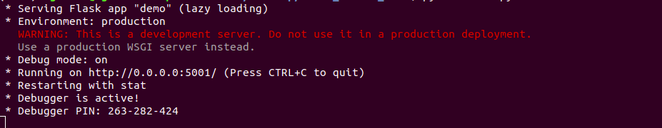

This **warning probably** brought you here.

So let's start off with some reasons on why you should'nt use the development server in production:

- While lightweight and easy to use, Flask’s built-in server is not suitable for production as it doesn’t scale well and by default serves only **one request at a time**.
- The development server is provided by Werkzeug for convenience, but is **not designed to be particularly efficient, stable, or secure.**

So, We have to use a wsgi server instead. In this tutorial we'll be using uwsgi and nginx to reverse proxy the requests.
Why a reverse proxy? **Reverse proxies** are used as a means of caching common content and compressing inbound and outbound data, resulting in a **faster** and **smoother** flow of traffic between clients and servers.

### Prerequisites:

- Have [docker](https://docs.docker.com/v17.09/engine/installation/) and [docker-compose](https://docs.docker.com/v17.09/compose/install/) installed.
- Have a [github](https://github.com/join) account.

### Step 1:

Go to this [repository](https://github.com/ST2-EV/simple-flask-production-server) on github and select **Use this template**.


### Step 2:

Give this repository a name and description and create the repository.

 
And you'll get something like this


### Step 3:

Clone this repository and open the project root folder in the terminal.
In the app directory you'll find a **views.py** file where you can add all the http endpoints that you want.
After that use these commands to build and start the service:

- To build:
  `sudo docker-compose build`
- To start the server:
  `sudo docker-compose up`

If all goes well you should see something like this (running on http://localhost:8000/):


### References:

- For a detailed explanation follow this [blog](https://pythonise.com/series/learning-flask/building-a-flask-app-with-docker-compose) by [Julian Nash](https://pythonise.com/authors/Julian%20Nash). Most of this code was taken form this blog. He also has a [video](https://youtu.be/dVEjSmKFUVI) explaining it.

Hope you were able to make use of this information.
Happy hacking!
[Subscribe to our newsletter](https://tinyletter.com/danklabs).

[](/post/about/)

> **If you are into memes, [check this this out](/blog/meh-meh/)** >  
